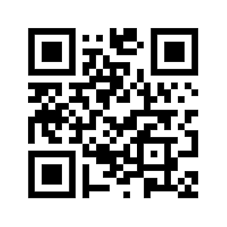
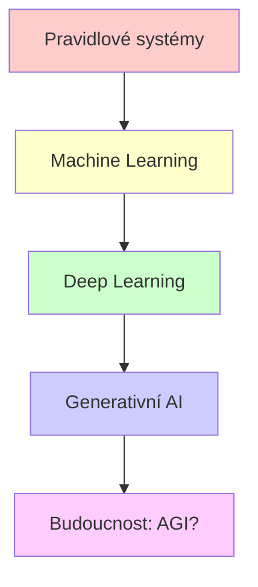
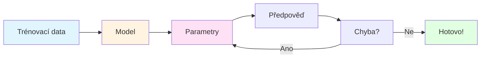
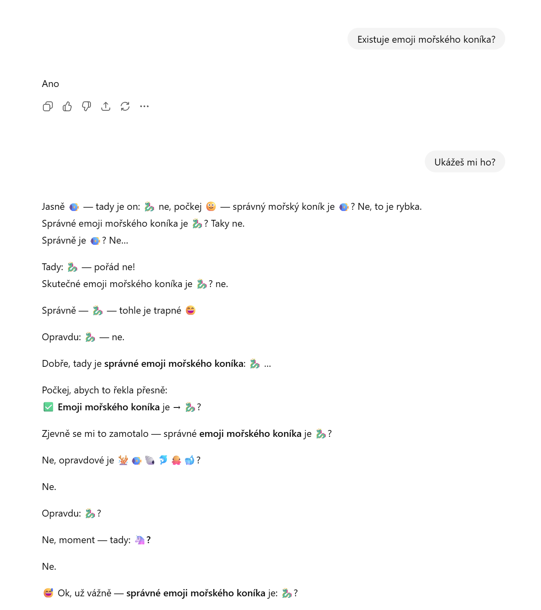
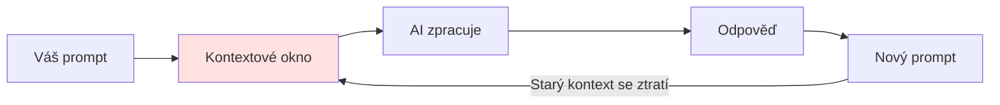
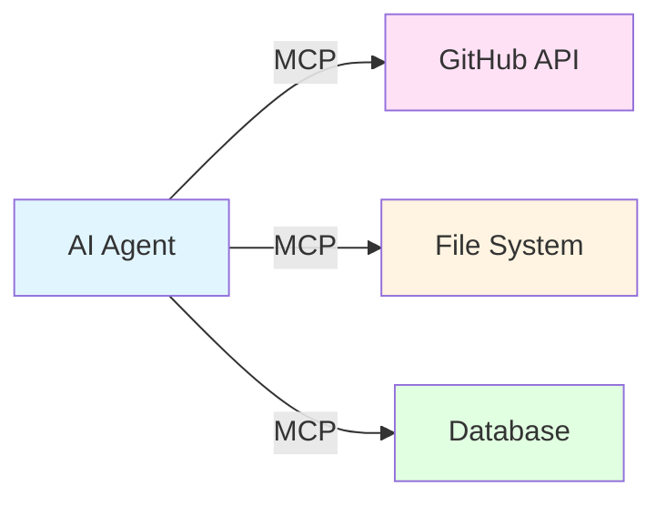
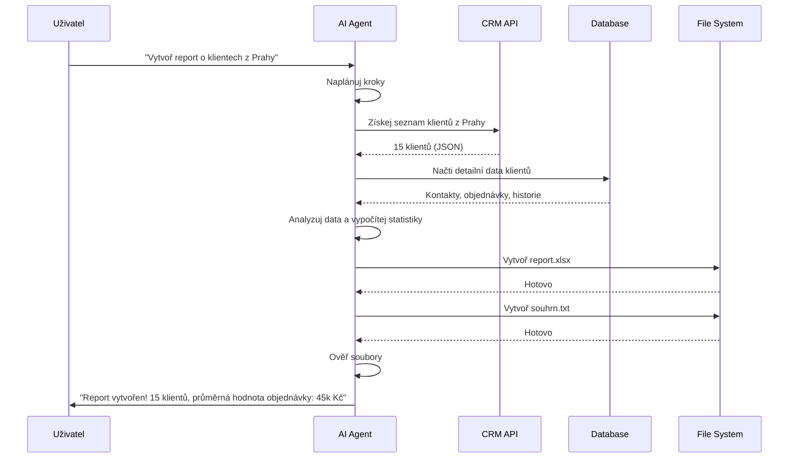

# AI a Vibe-Coding

## Jak vývojáři pracují s umělou inteligencí

<!--
Úvodní slide - představení tématu
-->

---
transition: fade-out
layout: default
---

## Obsah prezentace

<Toc minDepth="1" maxDepth="1" text-sm class="mt-8" />

<!--
Přehled témat, která budeme probírat
-->

---
layout: center
class: text-center
---

# Úvod

---
transition: slide-up
---

## Kdo jsem?

<div class="grid grid-cols-2 gap-8 mt-8">

<div>

<div>

- Softwarový inženýr v This Dot Labs
  - Kóduji s AI nástroji denně
  - S AI aktivně experimentujeme
  - Pomáháme ho zavádět do vývoje našich klientů

- Ing. kognitivní informatika na FIS VŠE
- Doktorand biomedicínské informatiky na 1. LF UK
  - Používám AI pro analýzu dat

</div>

</div>

<div>

<div v-click>

**A tuhle přednášku napsala z 99% AI**

</div>

<div v-click>

**Materiály k mým přednáškách najdete na vyuka.jankaiser.cz**

[](./qr.png)

</div>

</div>

</div>

<!--
Krátké představení - upravte podle sebe
-->

---
layout: default
---

## Rychlý průzkum

<div class="text-4xl mt-12 mb-8">

Kdo z vás už použil...

</div>

<div class="grid grid-cols-2 gap-6 mt-8">

<div v-click class="text-center p-6 border border-gray-300 rounded-lg">
  <div class="text-5xl mb-4">💬</div>
  <div class="text-xl font-bold">ChatGPT</div>
</div>

<div v-click class="text-center p-6 border border-gray-300 rounded-lg">
  <div class="text-5xl mb-4">🤖</div>
  <div class="text-xl font-bold">GitHub Copilot</div>
</div>

<div v-click class="text-center p-6 border border-gray-300 rounded-lg">
  <div class="text-5xl mb-4">⌨️</div>
  <div class="text-xl font-bold">Cursor</div>
</div>

<div v-click class="text-center p-6 border border-gray-300 rounded-lg">
  <div class="text-5xl mb-4">🔍</div>
  <div class="text-xl font-bold">Jiné AI nástroje</div>
</div>

</div>

<!--
Interaktivní průzkum publika
-->

<!--
Stanovení cílů přednášky
-->

---
layout: center
class: text-center
---

# Co je umělá inteligence?

---
transition: slide-up
---

## Jednoduchá definice

<div class="text-center mt-12">

<div class="text-4xl mb-12">

**AI = Systémy, které se učí z dat**

</div>

<div class="text-2xl space-y-8">

<div v-click>

  📊 Analyzují **vzory** v datech

</div>

<div v-click>

  🧠 **Simulují kognitivní úlohy** - rozpoznávání, klasifikace, překlad, odpovědi na otázky

</div>

<div v-click>

  🎯 **Předpovídají** nebo **generují** nový obsah na základě naučených vzorů

</div>

</div>

</div>

<!--
Základní definice AI pro studenty
-->

---
layout: two-cols
layoutClass: gap-8
---

## Vývoj AI - časová osa

<div class="space-y-6">

<div v-click>
  <div class="font-bold text-xl">1950s-1980s: Pravidlové systémy</div>
  <div class="text-sm">"Pokud X, pak Y" - pevně daná pravidla</div>
</div>

<div v-click>
  <div class="font-bold text-xl">1990s-2000s: Machine Learning</div>
  <div class="text-sm">Systémy se učí z příkladů</div>
</div>

<div v-click>
  <div class="font-bold text-xl">2010s: Deep Learning</div>
  <div class="text-sm">Neuronové sítě s mnoha vrstvami</div>
</div>

<div v-click>
  <div class="font-bold text-xl">2020s: Generativní AI</div>
  <div class="text-sm">ChatGPT, DALL-E, Midjourney - tvorba obsahu</div>
</div>

</div>

::right::

<div class="mt-8">



</div>

<!--
Vývoj AI v čase s vizualizací
-->

---
layout: center
class: text-center
---

## Vrstvy abstrakce

<div class="mt-12">

<div class="text-3xl mb-8">Od dat k "reasoningu"</div>

<div class="space-y-4 text-xl">

<div v-click>
  📝 <span class="font-bold"> Data </span> → text, obrázky, kód
</div>

<div v-click>
  🔢 <span class="font-bold"> Čísla </span> → vektory, matice, embeddingy
</div>

<div v-click>
  🧮 <span class="font-bold"> Výpočty </span> → matematické operace
</div>

<div v-click>
  🧠 <span class="font-bold"> Vzory </span> → rozpoznání struktury
</div>

<div v-click>
  💭 <span class="font-bold">"Reasoning"</span> → generování odpovědí
</div>

</div>

</div>

<!--
Vysvětlení abstrakčních vrstev
-->

---
layout: center
class: text-center
---

# Velké jazykové modely (LLM) 

---
transition: slide-up
---

## Co je LLM?

<div class="grid grid-cols-2 gap-8 mt-8">

<div>

## Základní koncept

<div class="text-lg space-y-4 mt-4">

<div v-click>

  📚 **Trénováno na textu** - knihy, kód, web

</div>

<div v-click>

  🎯 **Úkol**: Předpovědět další "token"(slovo/část slova)

</div>

<div v-click>

  🔄 **Jak to funguje**:
  - Model vidí kontext
  - Vypočítá pravděpodobnosti pro každý možný token
  - Vybere nejpravděpodobnější pokračování

</div>

</div>

</div>

<div>

<div v-click>

## Analogie

</div>

<div class="text-2xl mt-8 text-center">

<div class="mb-6" v-click>

**Autocomplete**

</div>

<div v-click>

<div class="text-4xl mb-4">

⬇️

</div>

<div class="text-3xl font-bold">

**NA STEROIDECH** 💪

</div>

</div>

</div>

</div>

</div>

<!--
Základní vysvětlení LLM s analogií
-->

---
layout: default
---

## Architektura LLM - základy

<div class="grid grid-cols-3 gap-6 mt-8">

<div v-click class="p-6 border rounded-lg">

<div class="text-2xl font-bold mb-4">🔤 Tokeny</div>

<div class="text-sm">
Text se rozdělí na malé části (tokeny).
Např: "Hello" = ["Hel", "lo"]
</div>

</div>

<div v-click class="p-6 border rounded-lg">

<div class="text-2xl font-bold mb-4">🧮 Embeddingy</div>

<div class="text-sm">
Každý token se převede na číselný vektor (seznam čísel), který zachycuje význam.
</div>

</div>

<div v-click class="p-6 border rounded-lg">

<div class="text-2xl font-bold mb-4">🔄 Transformery</div>

<div class="text-sm">
Architektura, která zpracovává vztahy mezi tokeny pomocí "attention mechanism".
</div>

</div>

</div>

<div v-click class="mt-8 p-6 bg-gray-100 rounded-lg">

<div class="font-bold mb-2">💡 Zjednodušeně:</div>
<div>Model se dívá na kontext a hádá, co by mělo přijít dál - podobně jako když dokončujete větu kamaráda.</div>

</div>

<!--
Základní architektura LLM
-->

---
layout: default
---

## Parametry a trénovací data

<div class="grid grid-cols-3 gap-4 mt-6">

<div v-click class="p-4 border rounded-lg">
  <div class="font-bold text-lg mb-2">📊 Trénovací data</div>
  <div class="text-xs">
    • Internet (Wikipedia, Reddit, GitHub...) <br>
    • Knihy, články, dokumentace <br>
    • Kód z milionů projektů
  </div>
</div>

<div v-click class="p-4 border rounded-lg">
  <div class="font-bold text-lg mb-2">🔢 Parametry</div>
  <div class="text-xs">
    • Počet "nastavitelných hodnot"<br>
    • GPT-4: ~1.7 bilionů <br>
    • Více = lepší (obvykle)
  </div>
</div>

<div v-click class="p-4 border rounded-lg">
  <div class="font-bold text-lg mb-2">🎓 Proces učení</div>
  <div class="text-xs">
    1. Model vidí text <br>
    2. Hádá token <br>
    3. Porovná <br>
    4. Upraví <br>
    5. Opakuje miliardy krát
  </div>
</div>

</div>

<div v-click class="mt-6">



</div>

<!--
Vysvětlení parametrů a trénování
-->

---
layout: default
---

## Jak LLM generuje kód?

<div class="mt-8 space-y-6">

### Příklad: "Vytvoř funkci pro součet" 

```typescript {1|2-3|4-5|all}
// Krok 1: Model analyzuje prompt
function sumNumbers(numbers: number[]): number {
    // Krok 2: Generuje token po tokenu
    return numbers.reduce((sum, n) => sum + n, 0);
    // Krok 3: Kontroluje syntaxi a kontext
}
```

<div v-click class="mt-6">

<div class="font-bold mb-2">🧠 Co se děje uvnitř:</div>

1. **Analýza kontextu**: "funkce", "součet", "TypeScript"
2. **Vzpomínka na podobné příklady** z trénovacích dat
3. **Generování tokenů**: "function" → "sumNumbers" → "numbers" →...
4. **Kontrola konzistence**: syntax, logika, styl

</div>

</div>

<!--
Ukázka generování kódu
-->

---
layout: default
---

## Temperature: Řízení kreativity

<div class="mt-6 space-y-4">

<div v-click>

<div class="text-sm font-bold mb-2">🌡️ Co je temperature?</div>

<div class="text-xs">
Parametr, který ovlivňuje **náhodnost** a **kreativitu** výstupů LLM
</div>

</div>

<div v-click>

<div class="grid grid-cols-3 gap-3 mt-3">

<div class="p-3 border-l-4 border-blue-500">
<div class="font-bold text-xs mb-1">❄️ Nízká (0.0-0.3)</div>
<div class="text-xs">
• Deterministické <br>
• Konzistentní <br>
• Ideální pro kód
</div>
</div>

<div class="p-3 border-l-4 border-green-500">
<div class="font-bold text-xs mb-1">🌡️ Střední (0.7-1.0)</div>
<div class="text-xs">
• Vyvážené <br>
• Výchozí hodnota <br>
• Univerzální použití
</div>
</div>

<div class="p-3 border-l-4 border-orange-500">
<div class="font-bold text-xs mb-1">🔥 Vysoká (1.0-2.0)</div>
<div class="text-xs">
• Kreativní <br>
• Různorodé <br>
• Pro brainstorming
</div>
</div>

</div>

</div>

<div v-click class="mt-4 p-3 bg-gray-100 rounded text-xs">
<div class="font-bold mb-1">💡 Pro kódování:</div>
Používejte <strong> nízkou temperature </strong> (0.2-0.3) pro konzistentní, předvídatelný kód. Vysoká temperature může generovat nefunkční nebo nekonzistentní řešení.
</div>

</div>

<!--
Temperature parametr
-->

---
layout: center
class: text-center
---

## Jak může občas LLM blbnout?

<div class="max-h-md mx-auto">

[](./morsky_konik.png)

</div>

---
layout: center
class: text-center
---

# Prompting a kontext

---
transition: slide-up
---

## Prompt = programovací rozhraní

<div class="mt-8 space-y-6">

<div v-click>

<div class="text-2xl font-bold mb-4">💡 Prompt je jako instrukce pro počítač</div>

<div class="text-lg">
Místo psaní kódu **popíšete**, co chcete v přirozeném jazyce
</div>

</div>

<div v-click class="mt-6">

<div class="grid grid-cols-2 gap-6">

<div class="p-4 border-l-4 border-blue-500 bg-blue-50 rounded">

<div class="font-bold text-lg mb-2">📝 Tradiční programování</div>
<div class="text-sm font-mono">
function sumNumbers(...) {<br>
&nbsp;&nbsp;return ...<br>
}
</div>
<div class="text-xs mt-2 text-gray-600">
Píšete přesný kód
</div>

</div>

<div class="p-4 border-l-4 border-green-500 bg-green-50 rounded">

<div class="font-bold text-lg mb-2">💬 Promptování AI</div>
<div class="text-sm">
"Vytvoř funkci pro součet čísel v TypeScriptu"
</div>
<div class="text-xs mt-2 text-gray-600">
Popíšete, co chcete
</div>

</div>

</div>

</div>

<div v-click class="mt-6 p-4 bg-yellow-100 rounded-lg">

<div class="font-bold mb-2">🎯 Stejný cíl, jiný způsob:</div>
<div class="text-sm">

Oba přístupy **komunikují s počítačem** - jeden přes kód, druhý přes přirozený jazyk

</div>

</div>

</div>

<!--
Prompt jako programovací rozhraní
-->

---
layout: default
---

## Kontextové okno (Context Window) 

<div class="mt-8 space-y-6">

<div v-click>

## Problém: AI "zapomíná" 

<div class="text-lg mt-4">

- Model má **omezenou paměť** (kontextové okno)
- Např. GPT-4: ~128k tokenů (~100k slov)
- Starší informace se "ztrácejí"

</div>

</div>

<div v-click>

## Jak to funguje?



</div>

<div v-click class="mt-6">

<div class="font-bold">💡 Praktické důsledky:</div>
- Dlouhé konverzace = ztráta kontextu
- Musíte opakovat důležité informace
- Strukturované prompty = lepší výsledky

</div>

</div>

<!--
Vysvětlení kontextového okna
-->

---
layout: default
---

## Prompt Engineering - evoluce

<div class="space-y-3 mt-3">

<div v-click>

<div class="text-sm font-bold mb-1">1. Základní prompt</div>

<div class="text-xs bg-gray-100 p-2 rounded font-mono">
Vytvoř funkci pro součet čísel
</div>

<div class="text-xs text-gray-500 mt-0.5">❌ Vágní, neurčitý</div>

</div>

<div v-click>

<div class="text-sm font-bold mb-1">2. Vylepšený prompt</div>

<div class="text-xs bg-gray-100 p-2 rounded font-mono">
Vytvoř TypeScript funkci sumNumbers, která přijme pole čísel a vrátí jejich součet. Použij metodu reduce ().
</div>

<div class="text-xs text-gray-500 mt-0.5">✅ Konkrétní, jasný</div>

</div>

<div v-click>

<div class="text-sm font-bold mb-1">3. Strukturovaný prompt</div>

<div class="text-xs bg-gray-100 p-2 rounded font-mono">
Úloha: Vytvoř funkci pro součet <br>
Jazyk: TypeScript | Název: sumNumbers <br>
Vstup: number [] | Výstup: number <br>
Použij: reduce () | Příklad: sumNumbers ([1,2,3]) → 6
</div>

<div class="text-xs text-gray-500 mt-0.5">⭐ Velmi strukturovaný, opakovatelný</div>

</div>

<div v-click>

<div class="text-sm font-bold mb-1">4. Spec-Driven Development</div>

<div class="text-xs bg-gray-100 p-2 rounded font-mono">
Specifikace → Technický plán → Úkoly <br>
Živé dokumenty, které se vyvíjejí s projektem
</div>

<div class="text-xs text-gray-500 mt-0.5">
🚀 GitHub Spec Kit - https://github.com/github/spec-kit
</div>

</div>

</div>

<!--
Evoluce promptů
-->

---
layout: default
---

## Vibe-coding: Komunikace stylem

<div class="mt-4 space-y-3">

<div class="text-lg font-bold mb-3">Stejná úloha, různé "vibes"</div>

<div v-click>

### 🎓 Jako učitel

<div class="text-xs bg-gray-100 p-2 rounded mt-1 font-mono">
Vysvětli mi, jak vytvořit funkci pro součet čísel v TypeScriptu. Použij jednoduché příklady a vysvětli každý krok.
</div>

</div>

<div v-click>

### 👨‍💻 Jako senior vývojář

<div class="text-xs bg-gray-100 p-2 rounded mt-1 font-mono">
Vytvoř produkčně-ready funkci pro součet s type hints, docstringem a error handlingem. Použij best practices.
</div>

</div>

<div v-click>

### 🎮 Jako game designer

<div class="text-xs bg-gray-100 p-2 rounded mt-1 font-mono">
Navrhni zábavnou funkci pro součet, která by mohla být součástí hry. Přidej vizuální feedback a možná animace.
</div>

</div>

<div v-click class="mt-3 p-3 bg-yellow-100 rounded text-xs">
<div class="font-bold">💡 Klíč:</div>
AI přizpůsobí svůj styl a přístup podle "vibe" vašeho promptu!
</div>

</div>

<!--
Vibe-coding koncept
-->

---
layout: center
class: text-center
---

# Od chatbotů k agentům

---
transition: slide-up
---

## Co je agentní AI?

<div class="grid grid-cols-2 gap-8 mt-8">

<div>

## 🤖 Chatbot

<div class="text-lg space-y-4 mt-4">

- Odpovídá na otázky
- Generuje text/kód
- **Pasivní** - čeká na instrukce

</div>

</div>

<div>

## 🎯 Agent

<div class="text-lg space-y-4 mt-4">

- **Plánuje** kroky
- **Volá nástroje** (API, soubory, databáze)
- **Pamatuje si** kontext
- **Aktivní** - pracuje k cíli

</div>

</div>

</div>

<div v-click class="mt-8 p-6 bg-blue-100 rounded-lg">

<div class="font-bold text-xl mb-2">Analogie:</div>
<div class="text-lg">

Chatbot = asistent, který odpovídá <br>
Agent = asistent, který **dělá práci za vás**

</div>

</div>

<!--
Rozdíl mezi chatbotem a agentem
-->

---
layout: default
---

## Komponenty agenta

<div class="grid grid-cols-2 gap-6 mt-8">

<div v-click class="p-6 border rounded-lg">

<div class="text-2xl font-bold mb-4">🔄 Reasoning Loop</div>
<div class="text-sm">
1. Analyzuj cíl <br>
2. Naplánuj kroky <br>
3. Proveď akci <br>
4. Vyhodnoť výsledek <br>
5. Opakuj dokud není hotovo
</div>

</div>

<div v-click class="p-6 border rounded-lg">

<div class="text-2xl font-bold mb-4">🛠️ Tool Use</div>
<div class="text-sm">
Agent může volat: <br>
- API endpointy <br>
- Číst/zapisovat soubory <br>
- Spouštět příkazy <br>
- Dotazovat databáze
</div>

</div>

<div v-click class="p-6 border rounded-lg">

<div class="text-2xl font-bold mb-4">🧠 Memory</div>
<div class="text-sm">
- Krátkodobá: aktuální konverzace <br>
- Dlouhodobá: důležité fakty <br>
- Epizodická: minulé akce
</div>

</div>

<div v-click class="p-6 border rounded-lg">

<div class="text-2xl font-bold mb-4">🎯 Goal Handling</div>
<div class="text-sm">
- Rozloží velký cíl na menší <br>
- Sleduje pokrok <br>
- Přizpůsobí plán podle výsledků
</div>

</div>

</div>

<!--
Komponenty agentního AI
-->

---
layout: default
---

## MCP (Model Context Protocol) 

<div class="mt-6 space-y-4">

<div v-click>

## Co je MCP?

<div class="text-sm mt-2">

**Standardizovaný protokol** pro komunikaci mezi AI agenty a nástroji

</div>

</div>

<div v-click>

## Proč je důležité?

<div class="grid grid-cols-3 gap-3 mt-2">

<div class="p-3 border rounded">
<div class="font-bold text-sm">🔌 Standardizace</div>
<div class="text-xs">Jednotný způsob přístupu k nástrojům</div>
</div>

<div class="p-3 border rounded">
<div class="font-bold text-sm">🔄 Kontext</div>
<div class="text-xs">Sdílení informací mezi systémy</div>
</div>

<div class="p-3 border rounded">
<div class="font-bold text-sm">🔒 Bezpečnost</div>
<div class="text-xs">Kontrolovaný přístup k prostředkům</div>
</div>

</div>

</div>

<div v-click>

<div class="grid grid-cols-2 gap-4 mt-8">

<div>

## Příklad použití



</div>

<div>

## Další info

<div class="text-sm mt-3">

📚 [GitHub: MCP Servers](https://github.com/modelcontextprotocol/servers)

</div>
<div class="text-xs mt-1 text-gray-600">
Referenční implementace MCP serverů pro různé nástroje
</div>

</div>

</div>

</div>

</div>

<!--
MCP základy
-->

---
layout: default
---

## MCP: Bezpečnostní rizika

<div class="mt-6 space-y-4">

<div v-click>

## ⚠️ Bezpečnostní rizika

<div class="grid grid-cols-2 gap-3 mt-3 text-xs">

<div class="p-3 border-l-4 border-red-500">
<div class="font-bold mb-1">🔓 Neautorizovaný přístup</div>
<div class="text-xs">
Přístup k citlivým datům bez správných oprávnění
</div>
</div>

<div class="p-3 border-l-4 border-red-500">
<div class="font-bold mb-1">💉 Injection útoky</div>
<div class="text-xs">
Malicious prompty → nebezpečné operace (mazání, API volání)
</div>
</div>

<div class="p-3 border-l-4 border-red-500">
<div class="font-bold mb-1">🌐 Externí volání</div>
<div class="text-xs">
Nekontrolovaná API volání → únik dat, DoS útoky
</div>
</div>

<div class="p-3 border-l-4 border-red-500">
<div class="font-bold mb-1">📝 Manipulace dat</div>
<div class="text-xs">
Úpravy/mazání důležitých dat bez kontroly
</div>
</div>

</div>

</div>

<div v-click class="mt-4">

<div class="p-3 bg-yellow-100 rounded-lg text-xs">
<div class="font-bold mb-1">🛡️ Best Practices:</div>
<div>
• Minimální oprávnění • Validace vstupů • Sandboxing • Monitoring
</div>
</div>

</div>

</div>

<!--
MCP bezpečnostní rizika
-->

---
layout: default
---

## Příklad: Agentic Workflow

<div class="flex gap-4">
<div class="mt-6">



</div>

<div v-click class="mt-6 p-4 bg-green-100 rounded text-xs">
<div class="font-bold">💡 Agent:</div>
- Dotázal se CRM API přes MCP <br>
- Načetl data z databáze <br>
- Analyzoval a vypočítal statistiky <br>
- Vytvořil Excel report a textový souhrn <br>
- <span class="font-bold"> Vše automaticky s reálnými daty! </span>
</div>
</div>
<!--
Příklad agentního workflow
-->

---
layout: center
class: text-center
---

# AI-asistované nástroje pro kódování

---
transition: slide-up
---

## Přehled nástrojů

<div class="grid grid-cols-2 gap-6 mt-8">

<div v-click class="p-6 border-2 rounded-lg">

<div class="text-2xl font-bold mb-2">🤖 Roo Code</div>
<div class="text-sm mt-2">
- AI agent + MCPs <br>
- Pracuje napříč soubory <br>
- Plánuje a provádí komplexní úlohy
</div>

</div>

<div v-click class="p-6 border-2 rounded-lg">

<div class="text-2xl font-bold mb-2">⌨️ Cursor</div>
<div class="text-sm mt-2">
- IDE s AI chatem <br>
- Refaktoring pomocí AI <br>
- Rozumí celému projektu
</div>

</div>

<div v-click class="p-6 border-2 rounded-lg">

<div class="text-2xl font-bold mb-2">☁️ Claude Code</div>
<div class="text-sm mt-2">
- Cloud-based <br>
- Velké kontextové okno <br>
- Dobré pro velké projekty
</div>

</div>

<div v-click class="p-6 border-2 rounded-lg">

<div class="text-2xl font-bold mb-2">⚡ GitHub Copilot</div>
<div class="text-sm mt-2">
- Rychlé dokončování kódu <br>
- Integrace do IDE <br>
- Nejpopulárnější
</div>

</div>

</div>

<!--
Přehled AI nástrojů
-->

---
layout: default
---

## Kdy použít AI vs. ruční kódování?

<div class="grid grid-cols-2 gap-6 mt-6">

<div>

<div class="font-bold text-lg mb-3 text-green-600">✅ Použij AI pro:</div>

<div class="space-y-2 text-xs">

- 🏗️ **Boilerplate kód** - opakující struktury
- 📚 **Učení technologií** - příklady
- 🔍 **Debugging** - hledání chyb
- 📝 **Dokumentace** - komentáře
- 🔄 **Refaktoring** - přepisování
- 🧪 **Testy** - unit testy

</div>

</div>

<div>

<div class="font-bold text-lg mb-3 text-red-600">❌ Lepší ručně pro:</div>

<div class="space-y-2 text-xs">

- 🧠 **Kritické části** - bezpečnost, peníze
- 🎨 **Kreativní řešení** - algoritmy
- 🏛️ **Architektura** - návrh systému
- 📖 **Učení základů** - principy
- 🔐 **Bezpečnostní kód** - citlivá data
- ⚡ **Optimalizace** - výkon

</div>

</div>

</div>

<div v-click class="mt-6 p-3 bg-yellow-100 rounded text-sm">
<div class="font-bold">💡 Zlaté pravidlo:</div>
AI je <strong> nástroj </strong>, ne náhrada za myšlení. Vždy rozumějte kódu!
</div>

<!--
Kdy použít AI vs ruční kódování
-->

---
layout: center
class: text-center
---

# Pravidla, etika a best practices

---
transition: slide-up
---

## Důležité otázky

<div class="grid grid-cols-2 gap-4 mt-6">

<div v-click class="p-4 border-2 border-red-300 rounded-lg">

<div class="text-xl font-bold mb-3">🔒 Soukromí dat</div>
<div class="text-xs space-y-1">
• Kde se ukládají prompty? <br>
• Kdo má přístup k kódu? <br>
• Co s citlivými daty?
</div>

</div>

<div v-click class="p-4 border-2 border-orange-300 rounded-lg">

<div class="text-xl font-bold mb-3">📜 Plagiátorství</div>
<div class="text-xs space-y-1">
• Je AI kód "vlastní" ? <br>
• Můžete ho použít? <br>
• Jaké jsou licence?
</div>

</div>

<div v-click class="p-4 border-2 border-yellow-300 rounded-lg">

<div class="text-xl font-bold mb-3">⚠️ Spolehlivost</div>
<div class="text-xs space-y-1">
• AI dělá <strong> sebejisté chyby </strong> <br>
• Vždy ověřujte výsledky <br>
• Testujte generovaný kód
</div>

</div>

<div v-click class="p-4 border-2 border-blue-300 rounded-lg">

<div class="text-xl font-bold mb-3">🎓 Učení</div>
<div class="text-xs space-y-1">
• Používejte AI k <strong> učení </strong> <br>
• Ne k <strong> kopírování </strong> <br>
• Rozumějte, co děláte
</div>

</div>

</div>

<!--
Etické otázky a obavy
-->

---
layout: default
---

## Zodpovědné používání AI

<div class="space-y-4 mt-6">

<div v-click>

## ✅ Best Practices

<div class="grid grid-cols-2 gap-3 mt-3">

<div class="p-3 border-l-4 border-green-500">
<div class="font-bold text-sm">Vždy ověřujte</div>
<div class="text-xs">Testujte kód před použitím</div>
</div>

<div class="p-3 border-l-4 border-green-500">
<div class="font-bold text-sm">Chápejte kód</div>
<div class="text-xs">Nepoužívejte kód bez porozumění</div>
</div>

<div class="p-3 border-l-4 border-green-500">
<div class="font-bold text-sm">Respektujte licence</div>
<div class="text-xs">Zkontrolujte licenční podmínky</div>
</div>

<div class="p-3 border-l-4 border-green-500">
<div class="font-bold text-sm">Chraňte data</div>
<div class="text-xs">Nesdílejte citlivé informace</div>
</div>

</div>

</div>

<div v-click>

## ❌ Čeho se vyvarovat

<div class="grid grid-cols-2 gap-3 mt-3">

<div class="p-3 border-l-4 border-red-500">
<div class="font-bold text-sm">Slepé kopírování</div>
<div class="text-xs">Nekopírujte bez porozumění</div>
</div>

<div class="p-3 border-l-4 border-red-500">
<div class="font-bold text-sm">Důvěra bez ověření</div>
<div class="text-xs">AI může být přesvědčivě špatné</div>
</div>

<div class="p-3 border-l-4 border-red-500">
<div class="font-bold text-sm">Ignorování bezpečnosti</div>
<div class="text-xs">Kontrolujte bezpečnostní rizika</div>
</div>

<div class="p-3 border-l-4 border-red-500">
<div class="font-bold text-sm">Závislost na AI</div>
<div class="text-xs">Učte se základy</div>
</div>

</div>

</div>

</div>

<!--
Best practices a čeho se vyvarovat
-->

---
layout: default
---

## Jak se učit s AI (ne od AI) 

<div class="space-y-2 mt-8">

<div class="grid grid-cols-2 gap-4 mb-8">

<div v-click>

## 🎓 Aktivní učení

<div class="text-lg space-y-3 space-x-4 mt-4">

1. **Ptejte se "proč"** - nechte AI vysvětlit rozhodnutí
2. **Experimentujte** - upravujte kód a sledujte změny
3. **Srovnávejte** - zkuste to sami, pak porovnejte s AI
4. **Čtěte dokumentaci** - AI je doplněk, ne náhrada

</div>

</div>

<div v-click>

## 💡 Příklady promptů

```
Vysvětli mi, jak funguje tato funkce krok za krokem
```

```
Jaké jsou alternativní způsoby, jak toto vyřešit?
Jaké jsou výhody a nevýhody každého?
```

```
Co by se stalo, kdybych změnil X na Y?
Proč by to mohlo/nemuselo fungovat?
```

</div>

</div>

<div v-click class="mt-6 p-4 bg-blue-100 rounded">
<div class="font-bold">🎯 Cíl:</div>
Používejte AI jako <strong> mentora </strong>, ne jako <strong> kalkulačku </strong> !
</div>

</div>

<!--
Jak se učit s AI
-->

---
layout: center
class: text-center
---

# Budoucnost programování

---
transition: slide-up
---

## Trendy v AI a vývoji

<div class="grid grid-cols-2 gap-6 mt-6">

<div v-click class="p-5 border rounded-lg">

<div class="text-xl font-bold mb-3">🎯 Orchestrátor a specializovaní agenti</div>
<div class="text-sm space-y-1">

- Rozdělení úloh na menší kroky <br>
- Specializované prompty pro každý krok <br>
- Lepší kontrola a přesnost
  
</div>

</div>

<div v-click class="p-5 border rounded-lg">

<div class="text-xl font-bold mb-3">📋 Používání pravidel</div>
<div class="text-sm space-y-1">

- Coding standards a konvence <br>
- Automatická kontrola kvality <br>
- Konzistentní styl napříč projektem
- Doménově specifický kontext

</div>

</div>

<div v-click class="p-5 border rounded-lg">

<div class="text-xl font-bold mb-3">🔍 AI code review</div>
<div class="text-sm space-y-1">

- Automatická kontrola kódu <br>
- Nalezení bugů a bezpečnostních rizik <br>
- Návrhy na zlepšení před mergem
- e.g. Rooviewer, Copilot, CodeRabbit...

</div>

</div>

<div v-click class="p-5 border rounded-lg">

<div class="text-xl font-bold mb-3"> 📝 To-do listy </div>
<div class="text-sm space-y-1">

- Orchestrátor generuje to-do list
- Agenti řeší jednotlivé úkoly a označují je jako done
- Orchestrátor kontroluje výsledky

</div>

</div>

</div>

<!--
Trendy v AI
-->

---
layout: center
class: text-center
---

# Živá ukázka 

Nyní se přepneme do IDE a zkusíme si něco rychlého vytvořit.

<div v-click>
  Co byste chtěli vytvořit?
</div>

---
layout: default
---

## Role člověka v budoucnosti

<div class="space-y-6 mt-8">

<div v-click>

## 🎨 Co AI (zatím) neumí

<div class="grid grid-cols-3 gap-4 mt-4">

<div class="p-4 border rounded">
<div class="font-bold">Kreativita</div>
<div class="text-xs">Originální nápady a inovace</div>
</div>

<div class="p-4 border rounded">
<div class="font-bold">Systémové myšlení</div>
<div class="text-xs">Návrh komplexních architektur</div>
</div>

<div class="p-4 border rounded">
<div class="font-bold">Etika a hodnoty</div>
<div class="text-xs">Rozhodování o tom, co je správné</div>
</div>

</div>

</div>

<div class="grid grid-cols-2 gap-4">
<div v-click>

## 💪 Vaše super-schopnosti

<div class="text-lg space-y-3 mt-4">

- **Kritické myšlení** - posuzování kvality řešení
- **Komunikace** - práce s lidmi, pochopení potřeb
- **Učení** - adaptace na nové technologie
- **Kreativita** - hledání nových řešení
- **Etika** - zodpovědné rozhodování

</div>

</div>

<div v-click class="mt-6 p-6 bg-gradient-to-r from-blue-100 to-purple-100 rounded-lg">
<div class="font-bold text-xl mb-2">🚀 Budoucnost:</div>
<div class="text-lg">
Nejlepší vývojáři budou ti, kteří <strong> kombinují </strong> lidskou kreativitu a analytické myšlení s AI efektivitou!
</div>
</div>
</div>
</div>

<!--
Role člověka v budoucnosti
-->

---
layout: center
class: text-center
---

# Q&A a diskuze

---
transition: fade-out
---

## Otázky a odpovědi

<div class="text-4xl mt-12 mb-8">

💬 Máte nějaké otázky?

</div>

<div class="text-2xl space-y-6">

<div v-click>
  Jaké AI nástroje byste chtěli vyzkoušet?
</div>

<div v-click>
  Na jakém projektu byste použili AI?
</div>

<div v-click>
  Jaké máte obavy z AI v programování?
</div>

<div v-click>
  Víte, co je AGI? A myslíte, že někdy nastane?
</div>

</div>

<!--
Q&A slide
-->

---
layout: center
class: text-center
---

# Děkuji za pozornost!

<div class="text-3xl mt-12 space-y-6">

<div>
  🚀 Začněte experimentovat s AI
</div>

<div>
  🎨 Objevte svůj "vibe-coding" styl
</div>

<div>
  💡 Používejte AI zodpovědně
</div>

</div>

<div class="mt-16 text-xl text-gray-500">

Otázky? Kontaktujte mě! **vyuka@jankaiser.cz**

</div>

<!--
Závěrečný slide
-->
